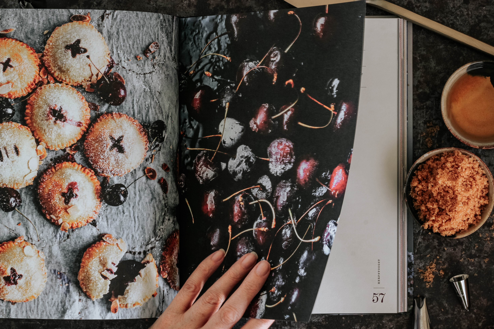
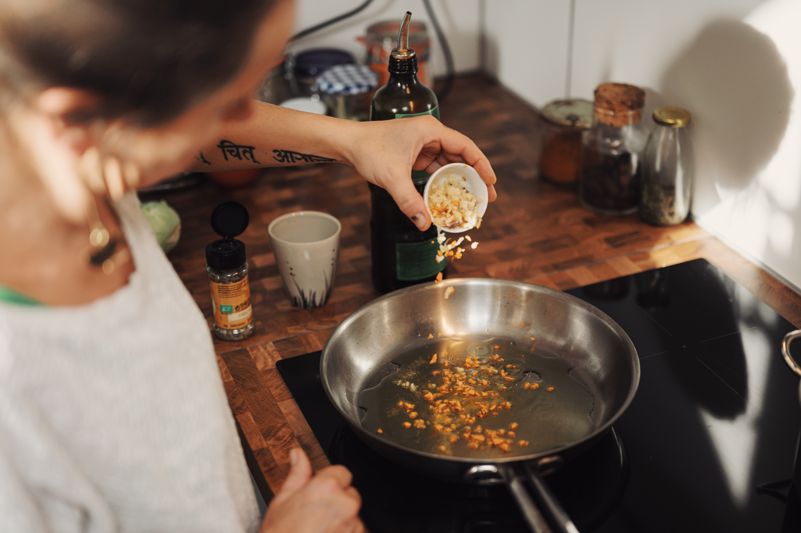

<!--StartFragment-->

Which is better: the web or books? Sometimes it's hard to tell, they are both after all amazing tools of inspiration. The first thing I think about is what I want to eat? You can spend hours searching books and websites but it doesn't matter if you don't know what you want. Next I think about what I have, no point trying to make a chicken curry with no chicken. Of course this changes depending on if I am planning a week ahead or if i'm cooking for right now.  From these questions I usually know if the recipe I need is in one of my cookbooks or if I have to search online for it. I would think it's fair to say that most people follow this, some may even have the recipe memorized. But what do I do when I'm looking for new recipes or just inspiration on how to improve my staples?

Well when I buy a new cook book the first thing that I do is go through the recipes and ear mark all the recipes that interest me to try for a later date. When I do try the recipes I always end up taking notes on what to change for next time, it seems to be rare that I leave a recipe completely unchanged. I also end up looking for recipes online using apps, websites and blogs to find inspiration. I can spend hours looking for recipes to try that I like the look of and once again adapting them to my tastes.

Cookbooks seem great. You have an expert chef with years of experience telling you what to do, they are reliable and trustworthy. I trust that when Jamie Oliver says that this recipe will only take 15 minutes that the recipe will only take 15 minutes. Just because I never do the recipe in 15 minutes does not mean that I no longer trust him as the recipe still works, just not in 15 minutes. Recipes online however can be done by anyone. The poster is often anonymous, I don't know who is telling me to add a tablespoon of herbs and spices to this recipe. For all I know I could be on a prank website. It may be unlikely but it does not detract from the idea of there being no accountability. Jamie Oliver wants his recipes to work and is relying on the idea that they will, the website isn't. But online has a wider range of recipes than a book could hold and is usually a lot cheaper than a recipe book with it being free. But even though they are more expensive, have less of a range of content and can be a pain to store there is something that constantly draws us to the cookbook.

So if I use both where have the recipes on this blog come from? Online. As much as I love cookbooks, sometimes you just need to use the web to find what you're looking for. A Lot of recipe books follow a theme which is great when I want Italian food or Chinese food or even food for when i'm on a diet like this blog. But they can sometimes be so similar and this blog includes recipes inspired by Chinese, Indian, Greek and Italian recipes, as I didn’t want a book on six pasta recipes for weight loss it became apparent that I needed to look online. On top of this I don't own a cookbook which includes all of the culinary influences that I wanted to use and even though some of my cookbooks may have some of these recipes searching online was just quicker once I realized this. So whilst recipe books and the content they include are a part of my daily cooking and have definitely influenced me in some of the changes to these recipes, if like me you want recipes that are more obscure or with more foreign influences, you may have to look online.

<!--EndFragment-->