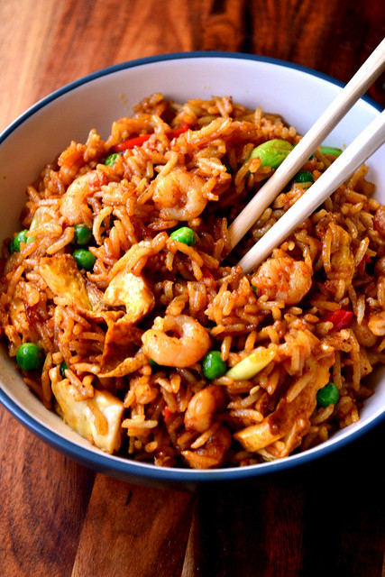

A twist on a noodle dish of the same name, Singapore Fried Rice is a fast food classic often featured on Chinese takeaway menus in Britain. Spicy and full of fresh ingredients, it may have little to do with Singapore, but it makes tempting comfort food.

Indeed, it would seem that Singapore fried rice is something of a misnomer; it has nothing to do with the city state. Still, things could be worse and far be it from me to go about changing the name of a delicious takeaway meal. It’ll sit beautifully beside [your chicken chow mein](http://frugalfeeding.com/2014/11/25/chicken-chow-mein/ "Chicken Chow Mein").

## Ingredients

* 3 tbsp sunflower oil
* 100g prawns
* 2 spring onions, roughly chopped
* 1 clove of garlic, sliced
* 1 large red chilli, sliced
  1 egg
  200g leftover rice, long grain
  a handful of garden peas
  ¼ tsp chilli powder
  ¼ tsp turmeric
  ¼ tsp garam masala
  1 clove, ground
  ½ star anise, ground
  1 tbsp soy sauce
  1 tbsp sesame oil  

## Method

Lorem ipsum dolor sit amet, consectetur adipisicing elit, sed do eiusmod tempor incididunt ut labore et dolore magna aliqua. Ut enim ad minim veniam, quis nostrud exercitation ullamco laboris nisi ut aliquip ex ea commodo consequat. Duis aute irure dolor in reprehenderit in voluptate velit esse cillum dolore eu fugiat nulla pariatur. Excepteur sint occaecat cupidatat non proident, sunt in culpa qui officia deserunt mollit anim id est laborum.

Lorem ipsum dolor sit amet, consectetur adipisicing elit, sed do eiusmod tempor incididunt ut labore et dolore magna aliqua. Ut enim ad minim veniam, quis nostrud exercitation ullamco laboris nisi ut aliquip ex ea commodo consequat. Duis aute irure dolor in reprehenderit in voluptate velit esse cillum dolore eu fugiat nulla pariatur. Excepteur sint occaecat cupidatat non proident, sunt in culpa qui officia deserunt mollit anim id est laborum.

Lorem ipsum dolor sit amet, consectetur adipisicing elit, sed do eiusmod tempor incididunt ut labore et dolore magna aliqua. Ut enim ad minim veniam, quis nostrud exercitation ullamco laboris nisi ut aliquip ex ea commodo consequat. Duis aute irure dolor in reprehenderit in voluptate velit esse cillum dolore eu fugiat nulla pariatur. Excepteur sint occaecat cupidatat non proident, sunt in culpa qui officia deserunt mollit anim id est laborum.

* Serves: 6
* Preparation time: 1 hour