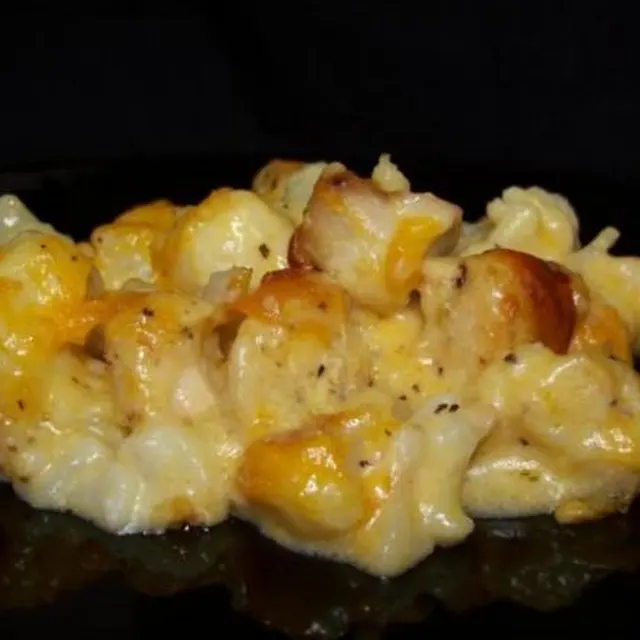

On diets like these sometimes high carb meals like pasta bakes are a big no no. Well now you have a taste and healthy alternative

## Ingredients

* 16 oz bag of cauliflower, thawed
* 3 Tbsp stick margarine
* 1 1/2 lb boneless, skinless chicken breast, cut into bite-size pieces
* 1 Tbsp chicken seasoning
* 2 1/2 tsp stick margarine
* 2 1/2 tsp all-purpose flour
* 2 cups shredded sharp cheddar cheese, divided
* 1 1/4 cups 2% milk, can use regular milk
* 1/2 tsp pepper or to taste
* 1/4 tsp salt

## Method

Preheat oven to 350 degrees.

In a skillet, large enough to hold the chicken, melt margarine over medium heat.

Add chicken and sprinkle with chicken seasoning; stirring well to coat. Cook until no longer pink and slightly browned. Set aside.

To make the Cheese Sauce: In a medium-sized saucepan, melt margarine over medium/low heat.

Add flour and cook until lightly browned. Stir in milk, a little at a time, until slightly thickened.

Stir 1 1/2 cups cheese into milk. To get the desired thickness or thinness, you might want to add a bit more milk. Add salt and pepper to taste.

In a large bowl, add cauliflower, chicken, and cheese sauce. Then pour into a greased 2-quart pan.

Sprinkle with remaining cheese. Bake at 350 degrees for 35 minutes.

* Servings: 6
* Cooking Time: 1 Hour