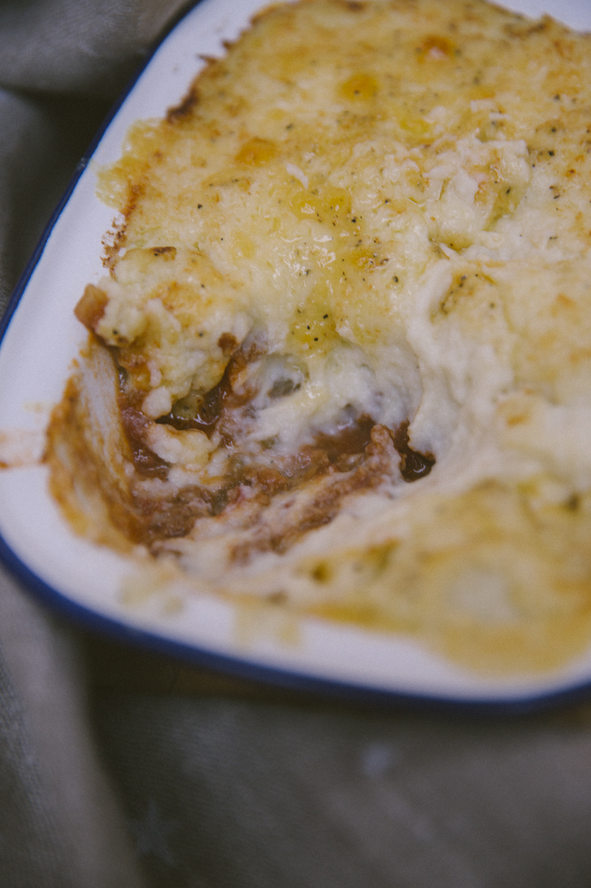

Once again we are replacing the carbs in this dish and like other recipes this dish does not sacrifice the joy that you get from this meal for the extra health that it provides.

Enjoy one the ultimate British classics guilty free.

## Ingredients

* Splash of olive oil
* 1 clove garlic, crushed
* 2 red onions, chopped
* 2 carrots, chopped
* 1 stick of celery, chopped
* 400g organic beef mince
* 1tbsp Worcester sauce
* 1tbsp soy sauce
* 1tbsp English mustard
* 1tsp paprika
* 1 large glass of red wine (or any you have open)
* 1 tin chopped tomatoes
* 2 cauliflowers
* Knob of butter
* Splash of double cream
* Salt + pepper

## Method

In a big pan heat your olive oil before tossing in your garlic, followed by the veg. Fry on a medium heat until soft.

Add your mince, keep moving around until fully broken up and nicely browned.

Splash in your Worcester sauce, soy sauce, (these will give it a lovely seasoning and rich colour), paprika, mustard, stir.

Add your wine and bubble away until reduced by about half. Add your tomatoes, pop a lid on and leave cooking away on a low heat.

After about an hour, take the lid off and let the sauce thicken up a little.

Give it a taste, see what you think.

If it doesn’t need any tweaking, let it bubble gently while you make the top of your pie.

Add about an inch of water to a big saucepan, throw in your cauliflower florets, a big pinch of salt and cover. Cook on a high heat for 5-10mins, until the florets are soft but take them off before they get soggy.

Drain with a colander, get rid of as much moisture as possible. Then blend with a generous knob of butter (there’s no such thing as too much – somewhere between the size of your thumb and your fist is about right!), a splash of cream and a really good grinding of black pepper.

Once smooth, you’re ready to assemble your pies.

Fill half the dish with meat, then top with mash.

Plough the field.

Top with grated cheddar cheese, if you like.

Either way, pop them under the grill on a high heat until bronzed.

Serving: 4

Cooking Time: 1 Hour