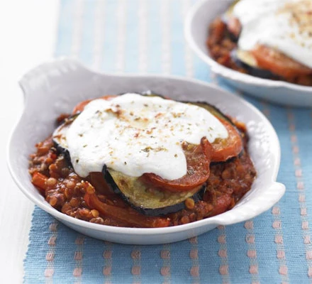

A rich and comforting Greek classic without the calories and with a little extra kick.

## Ingredients

* 200g frozen sliced peppers
* 3 garlic cloves , crushed
* 200g extra-lean minced beef
* 100g red lentils
* 2 tsp dried oregano , plus extra for sprinkling
* 500ml carton passata
* 1 aubergine , sliced into 1.5cm rounds
* 4 tomatoes , sliced into 1cm rounds
* 2 tsp olive oil
* 25g parmesan , finely grated
* 170g pot 0% fat Greek yogurt
* freshly grated nutmeg

Method

Cook the peppers gently in a large non-stick pan for about 5 mins – the water from them should stop them sticking. 

Add the garlic and cook for 1 min more, then add the beef, breaking up with a fork, and cook until brown. 

Tip in the lentils, half the oregano, the passata and a splash of water. 

Simmer for 15-20 mins until the lentils are tender, adding more water if you need to.

Meanwhile, heat the grill to Medium. 

Arrange the aubergine and tomato slices on a non-stick baking tray and brush with the oil. 

Sprinkle with the remaining oregano and some seasoning, then grill for 1-2 mins each side until lightly charred – you may need to do this in batches.

Mix half the Parmesan with the yogurt and some seasoning. 

Divide the beef mixture between 4 small ovenproof dishes and top with the sliced aubergine and tomato.

 Spoon over the yogurt topping and sprinkle with the extra oregano, Parmesan and nutmeg. 

Grill for 3-4 mins until bubbling. 

Serve with a salad, if you like.

* Serving: 4
* Cooking Time: 55 Minutes