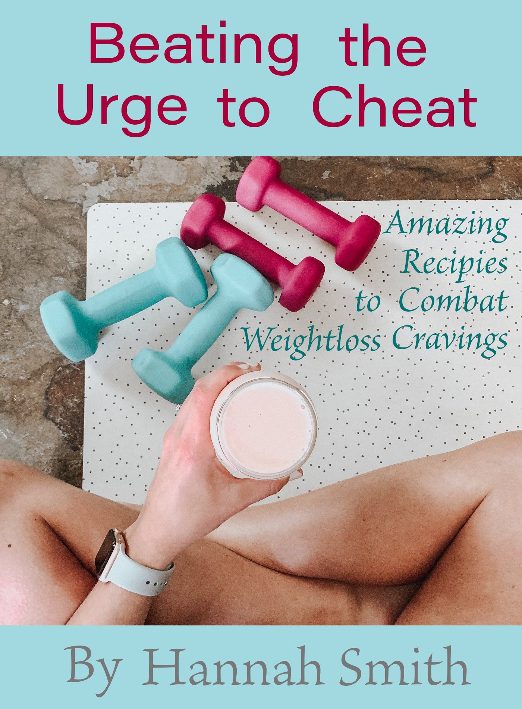

Enjoy the recipes from the book: Beating the urge to cheat.

All of the recipes are designed with a workout and weight loss diet in mind, with special detail towards stopping you craving the things that always force you to give up your diets in the past.

The pressure is on to lose weight yet all we seem to do is crave delicious food that is so bad for us. Just thinking about all the food we crave is nearly enough to make us give up and accept a fate of never slimming down. Yet now there is hope, this book contains 6 amazing recipes that help combat the cravings and are inspired by our favourite takeaways and comfort foods which are the biggest bane to our dieting goals.

\
Now you can discover the joy of weight loss with no expense and no cravings. Enjoy full bellies and leave those salads behind. Discover low fat fried rice's with half the oil of your take away, or moussakas with an Indian twist to stop you dialling the number to that curry house. All that and more lay waiting ahead of you in this diet saving book.